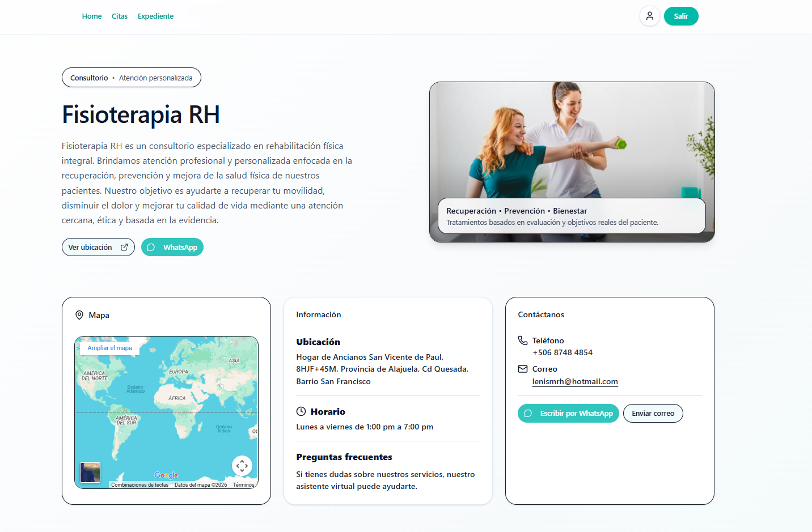
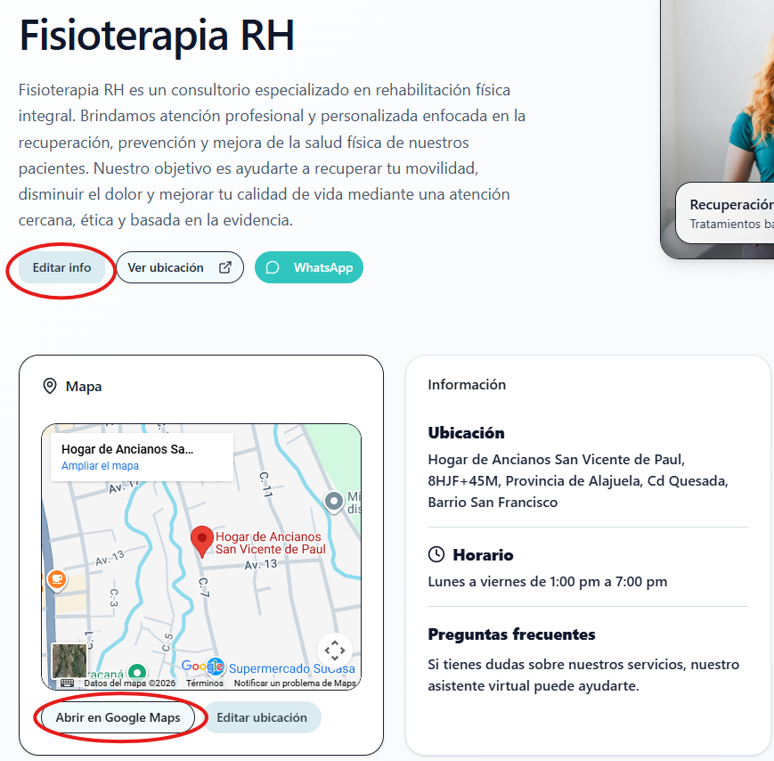
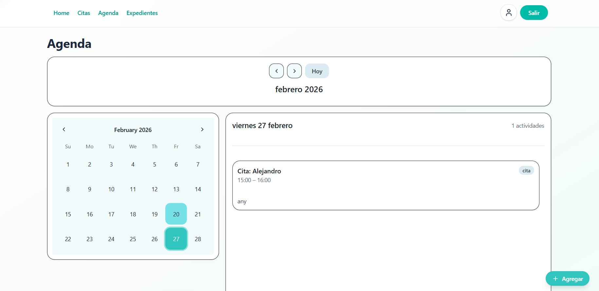
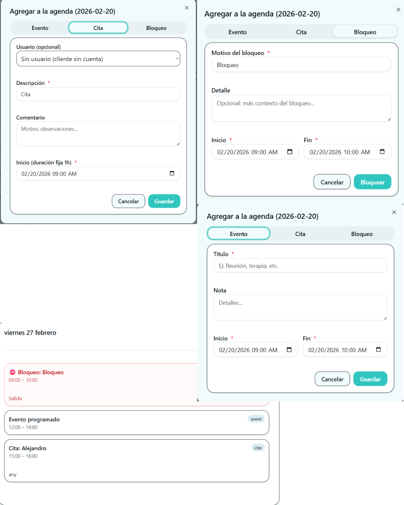
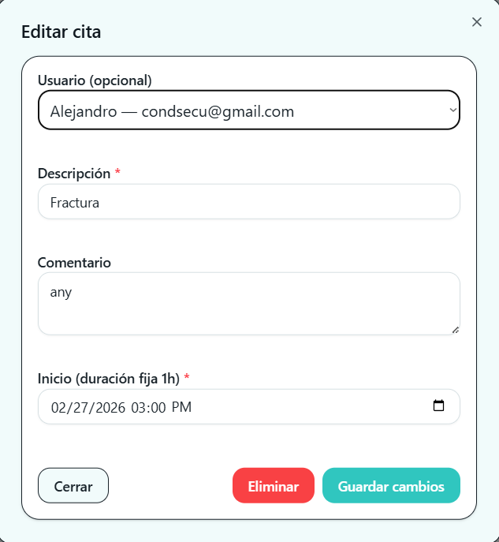
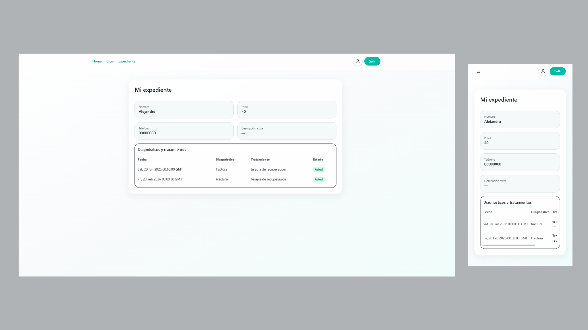

<h1 align="center">🩺 Fisioterapia RH</h1>
<h3 align="center">Plataforma Web de Gestión Clínica</h3>

  Sistema full-stack para digitalizar y centralizar la gestión clínica y administrativa.

  

  
  
  
  

---

# 🧠 Overview

Plataforma desarrollada bajo un enfoque formal de Ingeniería de Software que integra:

- 🧑‍⚕️ Gestión de pacientes  
- 📅 Agenda inteligente con validación de conflictos  
- 📩 Solicitud y confirmación de citas  
- 📂 Expediente médico digital  
- 💳 Pagos y facturación  
- 🔐 Control de acceso por roles  
- 🤖 Asistente virtual  

---

# 🏗 Arquitectura

React → Flask API → PostgreSQL

| Capa | Tecnología |
|------|------------|
| Frontend | React + TypeScript + shadcn/ui |
| Backend | Python + Flask |
| Base de Datos | PostgreSQL |
| Comunicación | REST API |
| Autenticación | Token Based |
| Autorización | Roles (admin / patient) |

---

# 🔐 Seguridad

- Registro, login y recuperación de contraseña  
- Contexto global de autenticación  
- Protección de rutas administrativas  
- Gestión segura de tokens  

Garantiza acceso restringido y protección de datos clínicos.

---

# 👥 Roles del Sistema

## 👩‍⚕️ Administrador
- Gestión de agenda y confirmación de citas  
- Administración de expedientes  
- Gestión de facturación  

## 🧑 Paciente
- Solicitud y consulta de citas  
- Acceso a expediente médico  
- Interacción con asistente virtual  

---

# 🏠 Home – Landing Dinámica

Página pública del consultorio y panel editable para la administradora.

---

## 🧑 Paciente

- Información dinámica del consultorio  
- Google Maps integrado  
- Contacto directo (WhatsApp / Email)  
- Carrusel de servicios  
- Chatbot integrado  

  

---

## 👩‍⚕️ Admin

- Edición de descripción  
- Edición dinámica de ubicación  
- Control de acceso por rol  

  

---

# 📅 Gestión Inteligente de Citas

Sistema central de solicitudes con validación en tiempo real.

---

## 🧑 Paciente

- Selección obligatoria de 3 horarios disponibles  
- Seguimiento de estado (`requested`, `confirmed`, `cancelled`)  
- Eliminación de cita  
- Vista detallada  

  

---

## 👩‍⚕️ Admin

- Filtros por estado y fecha  
- Confirmación de propuesta específica  
- Cancelación con motivo  
- Control de pago  
- Acceso rápido a contacto  

  

---

# 🗓 Agenda Profesional

Vista mensual y diaria tipo timeline con validación de colisiones.

  

## Tipos de entradas

### 1️⃣ Evento
- Título + nota opcional  
- Validación inicio < fin  

### 2️⃣ Cita Manual
- Asociación a paciente  
- Duración fija  
- Sincronizada con módulo de citas  

### 3️⃣ Bloqueo
- Motivo obligatorio  
- Previene asignación de citas  

  

  

---

# 📂 Expedientes Digitales

Gestión clínica estructurada con historial y control de tratamiento vigente.

---

## 👩‍⚕️ Administrador

- CRUD completo de expedientes  
- Vinculación por correo  
- Gestión de diagnósticos  
- Tratamiento vigente con Switch  
- Sincronización automática de citas  

  

---

## 🧑 Paciente

- Visualización de expediente  
- Historial clínico  
- Indicador de tratamiento activo  

  

---

# ⚙️ Lógica Técnica Destacada

- Arquitectura basada en hooks personalizados  
- Validación frontend + backend  
- Prevención de solapamientos  
- Render condicional por rol  
- Manejo optimista de estado  
- Sincronización automática con REST API  